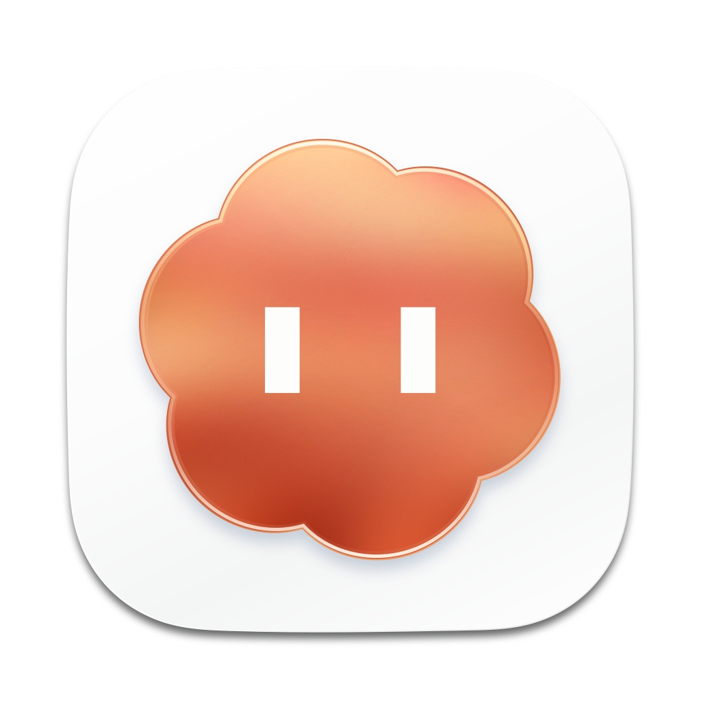

  

<h1 align="center">Claude in Codex</h1>

Use your local Claude Code inside the Codex App, right next to GPT.

  
  
  
  

English | <a href="docs/README.zh-CN.md">简体中文</a>

Claude in Codex is a small macOS menu bar app. It attaches to the Codex App you already have open, adds your local Claude models to its model picker, and runs Claude Code Sessions in the same window as your GPT tasks.

- **Native model picker.** Choose Claude from the Codex App's own model menu.
- **Your own Claude Code.** It uses the Claude Code already installed and signed in on your Mac.
- **Quota at a glance.** The menu shows how much Codex and Claude usage is left.
- **Safe to disconnect.** Quitting waits for running Sessions, and the Codex App keeps running.

## Install

1. Download the DMG from the [latest release](https://github.com/wbopan/claude-in-codex/releases/latest) and drag **Claude in Codex** into **Applications**.
2. Open the Codex App, then open Claude in Codex.
3. When the cloud in the menu bar turns solid and opens its eyes, pick a Claude model in the Codex App.

You need an Apple silicon Mac with macOS 14 or later, the official Codex App, and [Claude Code](https://docs.anthropic.com/en/docs/claude-code) signed in. The App is notarized by Apple, updates itself, and speaks English or Simplified Chinese to match your Mac.

## Privacy

Everything runs on your Mac. Claude conversations and sign-in stay with Claude Code, the App contacts only GitHub to check for updates, and it collects no usage data.

## Learn more

- [User guide](docs/guide.md): the menu and main window, features, settings, updates, data and uninstalling
- [Development](docs/development.md): building from source, tests and releases
- [Changelog](docs/CHANGELOG.md)

## License

MIT, see [LICENSE](LICENSE). Claude in Codex is an independent project and is not affiliated with Anthropic or OpenAI. Claude and Claude Code are trademarks of Anthropic. Codex and ChatGPT are trademarks of OpenAI.
